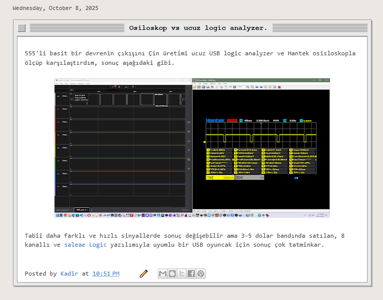

# Blogger macOS Window Theme

Designed by **Kadir Doğan** — [doankadir.blogspot.com](https://doankadir.blogspot.com)

Gives Blogger blog posts a classic Mac OS window appearance — stipple title bar, 3D close box, scroll tracks, and inner borders.



---

## Features

- Classic Mac OS stipple pattern title bar with 3-tone bitmap texture
- 3D bevel close box
- Left/right scroll track columns with inner borders
- Bottom closing bar
- Post title shown in the title bar
- One-click **copy** button on every code block
- Horizontal scroll for long code, hidden overflow for regular content

---

## Installation

### 1. Open your Blogger theme editor

Go to **Blogger Dashboard → Theme → Edit HTML**

### 2. Add the CSS

Find the line `]]></b:skin>` and paste the contents of `style.css` immediately before it.

### 3. Add the JavaScript

Find `</body>` near the bottom and paste the following immediately before it:

```xml
<script type='text/javascript'>
//<![CDATA[
  /* paste contents of script.js here */
//]]>
</script>
```

### 4. Save

Click **Save theme**. Your posts will now render with the macOS window frame.

---

## Files

| File | Description |
|------|-------------|
| `style.css` | All window frame CSS — paste into `b:skin` |
| `script.js` | Title bar DOM builder + copy button — paste before `</body>` |
| `theme.xml` | Full ready-to-import Blogger XML (Awesome Inc. base theme) |

---

## Customization

| Variable | Location | Default | Description |
|----------|----------|---------|-------------|
| Title bar height | `.mac-top` in CSS | `32px` | Height of the window title bar |
| Title font size | `.mac-titlebar-text` | `14px` | Font size of the title |
| Scroll track width | `.mac-scroll-l` / `.mac-scroll-r2` | `7px` | Width of left/right gray tracks |
| Close box position | `.mac-corner-btn::after` | `top:8px left:8px` | Position of the close box |

---

## Based on

**Awesome Inc.** — Blogger template by Tina Chen (tinachen.org)
Built-in Blogger theme, used as the base layout for this project.

---

## License

MIT — free to use and modify. Credit appreciated but not required.
